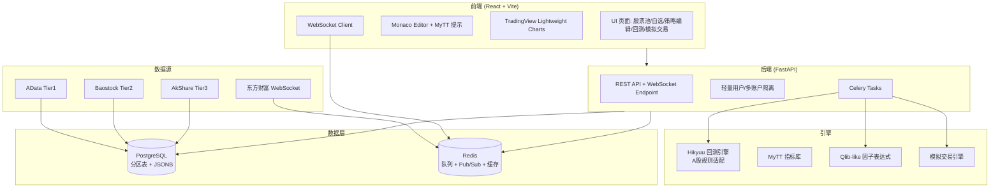

```markdown
# Leek Quant 开发架构文档

**版本**：v0.1（基于 QuantDinger 减法版）  
**项目定位**：纯A股本地优先量化交易平台，隐私至上，Docker Compose 一键部署。从 QuantDinger（多市场AI量化平台）裁剪而来，仅保留并强化A股能力。  
**核心原则**：最大化复用开源项目（Hikyuu、MyTT、AData、Baostock、AkShare、Qlib），最小化自研；聚焦A股差异化规则（T+1、涨跌停、费用、停牌/退市）；数据与策略完全本地化。

## 1. 系统架构概述

Leek Quant 采用前后端分离 + 异步任务架构：

- **前端**：React + Vite + Tailwind CSS + shadcn/ui  
  - 图表：TradingView Lightweight Charts  
  - 代码编辑：Monaco Editor（内置 MyTT 函数提示、语法高亮）  
  - 实时看板：WebSocket 订阅推送

- **后端**：FastAPI（API 服务） + Celery（异步任务：数据更新、回测、因子计算） + Redis（任务队列、实时行情广播、缓存）  
- **数据库**：PostgreSQL（统一存储，取代 DuckDB+Parquet+SQLite）  
  - 支持分区表（K线按年/股票分区）  
  - JSONB 存储灵活配置与曲线数据

- **回测引擎**：Hikyuu（C++ 高性能内核，Python 接口，深度适配A股规则）  
- **技术指标**：MyTT（单文件，通达信/同花顺兼容，零依赖，直接 `import`）

- **数据层**：
  - 历史数据：AData（Tier1，主） → Baostock（Tier2，财务/估值） → AkShare（Tier3，兜底，分钟线）
  - 实时行情：东方财富 WebSocket（自建解析器）或 AllTick，推送至 Redis Pub/Sub 广播
  - 交易日历：独立服务 + 数据库表

- **部署**：Docker Compose（PostgreSQL、Redis、FastAPI、Celery Worker、Celery Beat、React Nginx 静态服务）

**系统架构图**（文本 Mermaid 表示，可直接复制到支持 Mermaid 的工具查看）：



## 2. PostgreSQL 完整表设计

使用 PostgreSQL 分区表、索引优化（`stock_code + trade_date` 复合索引）、JSONB 存储曲线/配置。所有用户数据带 `user_id`/`account_id` 隔离。

### 基础/市场数据

```sql
-- 股票基础信息
CREATE TABLE stock_basic (
    code VARCHAR(10) PRIMARY KEY,  -- sz000001 / sh600000
    name VARCHAR(100),
    market VARCHAR(10),            -- 主板/创业板/科创板
    is_st BOOLEAN DEFAULT FALSE,
    is_delisted BOOLEAN DEFAULT FALSE,
    list_date DATE,
    delist_date DATE,
    updated_at TIMESTAMP DEFAULT CURRENT_TIMESTAMP
);

-- 交易日历
CREATE TABLE trade_calendar (
    trade_date DATE PRIMARY KEY,
    is_open BOOLEAN,
    is_weekend BOOLEAN,
    is_holiday BOOLEAN
);

-- 日线K线（按年分区，推荐按 code 或 trade_date 分区）
CREATE TABLE daily_kline (
    id BIGSERIAL,
    code VARCHAR(10),
    trade_date DATE,
    open REAL,
    high REAL,
    low REAL,
    close REAL,
    volume BIGINT,
    amount REAL,
    adj_factor REAL,               -- 复权因子
    pre_close REAL,                -- 前收（用于停牌处理）
    is_suspended BOOLEAN DEFAULT FALSE,  -- 停牌
    PRIMARY KEY (code, trade_date)
) PARTITION BY RANGE (trade_date);     -- 或按 code 哈希分区

-- 创建分区示例（每年一个）
CREATE TABLE daily_kline_y2020 PARTITION OF daily_kline FOR VALUES FROM ('2020-01-01') TO ('2021-01-01');

-- 基本面（JSONB 灵活存储三大报表、PE/PB/ROE 等）
CREATE TABLE stock_fundamentals (
    code VARCHAR(10),
    trade_date DATE,
    pe REAL,
    pb REAL,
    roe REAL,
    data JSONB,                     -- 完整财务报表等
    PRIMARY KEY (code, trade_date)
);
```

### 用户/策略数据

```sql
CREATE TABLE users (id SERIAL PRIMARY KEY, username VARCHAR UNIQUE, ...);

CREATE TABLE sim_accounts (
    id SERIAL PRIMARY KEY,
    user_id INT REFERENCES users(id),
    account_name VARCHAR(50),
    init_cash NUMERIC(20,4),
    available_cash NUMERIC(20,4),
    total_asset NUMERIC(20,4),
    created_at TIMESTAMP DEFAULT CURRENT_TIMESTAMP
);

CREATE TABLE watchlist (
    id SERIAL PRIMARY KEY,
    user_id INT,
    group_name VARCHAR(50),
    code VARCHAR(10) REFERENCES stock_basic(code),
    UNIQUE(user_id, group_name, code)
);

CREATE TABLE stock_pools (
    id SERIAL PRIMARY KEY,
    user_id INT,
    pool_name VARCHAR(100),
    filter_config JSONB,            -- 动态筛选条件
    created_at TIMESTAMP
);

CREATE TABLE strategies (
    id SERIAL PRIMARY KEY,
    user_id INT,
    name VARCHAR(100),
    python_code TEXT,               -- 完整策略源码（import MyTT 等）
    config JSONB,                   -- 参数配置
    version INT DEFAULT 1,
    created_at TIMESTAMP
);
```

### 回测与信号

```sql
CREATE TABLE backtest_results (
    id SERIAL PRIMARY KEY,
    strategy_id INT REFERENCES strategies(id),
    user_id INT,
    params JSONB,
    performance JSONB,              -- 收益、夏普、最大回撤等
    trades JSONB,                   -- 交易记录
    equity_curve JSONB,             -- 净值曲线
    created_at TIMESTAMP
);

CREATE TABLE signal_log (
    id BIGSERIAL,
    user_id INT,
    strategy_id INT,
    code VARCHAR(10),
    signal_time TIMESTAMP,
    signal_type VARCHAR(20),        -- BUY / INCREASE / DECREASE / SELL / HOLD
    target_position NUMERIC(10,4),  -- 目标仓位比例 0-1
    snapshot JSONB,                 -- 当时K线/因子快照
    PRIMARY KEY (code, signal_time)
);
```

### 因子与打分

```sql
CREATE TABLE factor_values (
    code VARCHAR(10),
    trade_date DATE,
    factor_name VARCHAR(100),
    value NUMERIC(20,8),
    PRIMARY KEY (code, trade_date, factor_name)
);

CREATE TABLE scoring_rank (
    trade_date DATE,
    code VARCHAR(10),
    score NUMERIC(10,4),            -- 综合打分
    rank INT,
    factor_breakdown JSONB,         -- 各因子贡献
    PRIMARY KEY (trade_date, code)
);

CREATE TABLE factor_analysis (
    factor_name VARCHAR(100),
    period_start DATE,
    period_end DATE,
    ic NUMERIC(10,6),
    ir NUMERIC(10,6),
    details JSONB
);
```

### 模拟交易（6表完整体系）

```sql
-- 模拟账户（已在上文 sim_accounts）

CREATE TABLE sim_positions (
    id SERIAL PRIMARY KEY,
    account_id INT REFERENCES sim_accounts(id),
    code VARCHAR(10),
    quantity NUMERIC(20,4),         -- 持仓股数
    cost_price NUMERIC(20,4),       -- 平均成本
    market_value NUMERIC(20,4),
    floating_pnl NUMERIC(20,4),
    updated_at TIMESTAMP
);

CREATE TABLE sim_orders (
    id BIGSERIAL PRIMARY KEY,
    account_id INT,
    code VARCHAR(10),
    direction VARCHAR(10),          -- BUY / SELL
    order_type VARCHAR(10),         -- LIMIT / MARKET
    price NUMERIC(20,4),
    quantity NUMERIC(20,4),
    status VARCHAR(20),             -- PENDING / PARTIAL / FILLED / CANCELLED
    created_at TIMESTAMP,
    updated_at TIMESTAMP
);

CREATE TABLE sim_trades (
    id BIGSERIAL PRIMARY KEY,
    order_id BIGINT REFERENCES sim_orders(id),
    account_id INT,
    code VARCHAR(10),
    direction VARCHAR(10),
    price NUMERIC(20,4),
    quantity NUMERIC(20,4),
    amount NUMERIC(20,4),
    commission NUMERIC(20,4),       -- 佣金
    stamp_tax NUMERIC(20,4),        -- 印花税（卖出）
    transfer_fee NUMERIC(20,4),     -- 过户费
    trade_time TIMESTAMP
);

CREATE TABLE sim_cash_flow (
    id BIGSERIAL PRIMARY KEY,
    account_id INT,
    type VARCHAR(50),               -- TRADE / DIVIDEND / INTEREST / FEE
    amount NUMERIC(20,4),
    balance_after NUMERIC(20,4),
    remark TEXT,
    created_at TIMESTAMP
);

CREATE TABLE sim_daily_nav (
    account_id INT,
    trade_date DATE,
    total_asset NUMERIC(20,4),
    daily_return NUMERIC(10,6),
    cumulative_nav NUMERIC(20,4),
    PRIMARY KEY (account_id, trade_date)
);
```

索引建议：所有核心查询表添加 `BTREE` 索引于 `(code, trade_date)`、` (account_id, trade_date)` 等。

## 3. 数据源多层回退与增量拉取详细设计

**三层回退逻辑**（优先级 Tier1 → Tier2 → Tier3）：

```python
async def fetch_kline(code, start_date, end_date):
    try:
        df = adata.stock.kline(code=code, start=start_date, end=end_date, ...)  # AData Tier1
        return df
    except:
        try:
            df = baostock.query_history_k_data_plus(...)  # Tier2，支持复权、财务
            return df
        except:
            df = ak.stock_zh_a_hist(...)  # Tier3 兜底
            return df
```

**增量更新机制**：

- 在 `stock_basic` 或独立 `stock_update_log` 表记录每只股票 `last_update_date`。
- 每日 Celery Beat 任务：查询交易日历，针对 `last_update_date < yesterday` 的股票，仅拉取后续数据。
- 复权处理：优先使用 AData/Baostock 提供的复权因子，存储在 `daily_kline.adj_factor`。
- 停牌/退市：从 `stock_basic` 标记，拉取时跳过或标记 `is_suspended`。
- 分钟线：仅在需要时通过 AkShare 拉取（避免全量存储压力）。

**实时行情**：独立模块连接东方财富 WebSocket，解析推送（参考公开 Level2 示例，处理压缩/订阅），转换为标准化 tick，存 Redis Pub/Sub，供前端与信号模块订阅。

## 4. 回测引擎集成方案（Hikyuu 适配层）

Hikyuu 是 C++ 内核 + Python 接口的高性能框架，已深度适配A股（T+1、涨跌停、费用等规则可通过配置或自定义组件实现）。

**集成方式**：

1. Docker 中安装 `hikyuu`（`pip install hikyuu` 或从源码编译，确保 C++ 依赖）。
2. 适配层（`hikyuu_adapter.py`）：
   - 将 PostgreSQL 中的 `daily_kline` 转换为 Hikyuu StockManager / KData。
   - 复用 Hikyuu 的 `SYS_Simple`、`Signal`、`MoneyManager` 等组件。
   - A股规则：通过自定义 `TradeCost` 实现印花税/佣金/过户费；`Environment` 处理 T+1 与涨跌停；停牌通过过滤 Bar 或自定义逻辑。
3. 策略映射：用户在 Monaco 编辑的 Python 源码（使用 MyTT 计算指标），转换为 Hikyuu 的信号指示器（`SG`）。
4. 异步执行：Celery Worker 调用 `hikyuu.run()`，结果（绩效、交易记录、净值曲线）序列化存入 `backtest_results` JSONB。
5. 参数优化：复用 Hikyuu 内置优化器。

示例适配伪代码：

```python
from hikyuu import *
import pandas as pd
from MyTT import *  # 用户策略中直接可用

def run_hikyuu_backtest(strategy_code, stock_list, query):
    # 加载数据到 Hikyuu
    sm = StockManager()
    for code in stock_list:
        k = convert_pg_to_hk_kdata(code)  # 自定义转换函数
        sm.add_stock(code, k)
    
    # 构建系统（复用 Hikyuu 组件 + 用户信号逻辑）
    my_tm = crtTM(init_cash=300000, cost=FixedCost(...))  # A股费用
    my_sg = create_signal_from_strategy(strategy_code)    # 解析用户代码生成 SG
    sys = SYS_Simple(tm=my_tm, sg=my_sg)
    sys.run(sm[stock], query)
    return extract_results(sys)
```

## 5. 五档信号生成逻辑与状态机

**五档信号**：买入（BUY）、增持（INCREASE）、减仓（DECREASE）、卖出（SELL）、观望（HOLD）。

**状态机逻辑**（持仓状态驱动）：

- **空仓**：
  - BUY / INCREASE → 执行买入（目标仓位 100% 或增持比例）
  - DECREASE / SELL → 忽略（或转为 HOLD）
  - HOLD → 无操作

- **持仓**：
  - BUY → 增持至更高仓位
  - INCREASE → 部分增持
  - DECREASE → 部分卖出（目标仓位降低）
  - SELL → 清仓卖出
  - HOLD → 保持当前仓位

**生成流程**（Celery 定时或实时触发）：
1. 获取最新 K线 + 因子值（MyTT 计算技术指标，Qlib-like 表达式计算多因子）。
2. 执行策略源码中的 `generate_signal()` 函数（返回五档 + 目标仓位）。
3. 记录到 `signal_log`，推送至前端。
4. 模拟交易模块根据信号 + 当前持仓状态执行委托。

## 6. 模拟交易引擎工作流

完整委托 → 成交 → 持仓 → 流水 → 净值链路，严格模拟A股规则：

1. **下单**：`sim_orders` 插入 PENDING 委托，检查 T+1（买入当日不可卖）、涨跌停（限价检查）。
2. **撮合**（定时或实时 Bar 驱动）：根据最新价/五档，判断是否成交（市价/限价），生成 `sim_trades`，扣除费用（印花税仅卖出、佣金双边、过户费）。
3. **更新持仓**：`sim_positions` 计算浮动盈亏、市值。
4. **资金流水**：`sim_cash_flow` 记录交易、分红等。
5. **每日快照**：交易日结束，生成 `sim_daily_nav`，计算日收益率、累计净值。
6. **风控**：涨跌停无法成交时挂单或部分成交；停牌股票暂停交易。

引擎作为独立模块，可与 Hikyuu 回测结果联动验证。

## 7. 多因子打分模块设计

参考 Qlib 因子表达式，轻量实现：

- **因子定义**：JSON/DSL 或 Python 函数，支持估值（PE/PB）、成长（营收增速）、质量（ROE）、动量（过去收益）、技术（MyTT RSI/MACD 等）。
- **计算**：Celery Worker 并行计算，存 `factor_values`（利用 PG 聚合加速）。
- **打分排名**：加权综合得分（可配置权重），每日生成 `scoring_rank`。
- **分析**：计算 IC（信息系数）、IR（信息比率），存 `factor_analysis`，支持分组/行业中性。
- **股票池**：动态筛选基于因子阈值或排名。

## 8. 前端页面与组件规划

- **首页**：市场概览 + 实时自选看板（TradingView 多图）。
- **股票池**：全市场列表、动态筛选（ST/退市标记）、导出。
- **自选股**：分组管理、实时行情推送。
- **策略中心**：Monaco Editor（Python + MyTT 自动补全）、保存/版本管理。
- **回测页面**：参数设置、Hikyuu 执行、绩效图表（净值曲线、交易记录）。
- **信号与模拟**：五档信号日志、模拟账户管理、持仓/委托/成交/流水/净值曲线。
- **因子分析**：因子库、打分排行、IC/IR 热力图。
- **监控**：定时任务状态、数据更新告警。

组件复用 shadcn/ui + Tailwind。

## 9. Docker Compose 部署配置

`docker-compose.yml` 示例：

```yaml
version: '3.8'

services:
  postgres:
    image: postgres:16
    environment:
      POSTGRES_DB: leekquant
      POSTGRES_USER: postgres
      POSTGRES_PASSWORD: password
    volumes:
      - pgdata:/var/lib/postgresql/data
    ports: ["5432:5432"]

  redis:
    image: redis:7
    ports: ["6379:6379"]

  backend:
    build: ./backend
    depends_on: [postgres, redis]
    environment:
      DATABASE_URL: postgresql+asyncpg://...
      REDIS_URL: redis://redis:6379
    command: uvicorn main:app --host 0.0.0.0

  celery-worker:
    build: ./backend
    command: celery -A tasks worker -l info
    depends_on: [redis, backend]

  celery-beat:
    build: ./backend
    command: celery -A tasks beat -l info
    depends_on: [redis]

  frontend:
    build: ./frontend
    ports: ["3000:80"]
    depends_on: [backend]

volumes:
  pgdata:
```

后端 Dockerfile 需包含 `hikyuu`、`adata`、`baostock`、`akshare`、`mytt`（复制单文件）等依赖。

## 10. 风险与应对措施

- **数据源不稳定**：三层回退 + 本地缓存 + 告警（Celery 失败重试 + Redis 监控）。
- **性能**：K线分区表 + Celery 分布式 Worker；大回测使用 Hikyuu C++ 加速。
- **隐私与安全**：全本地部署，无云端；轻量用户系统使用 JWT + 数据库隔离。
- **A股规则偏差**：Hikyuu 核心 + 自定义 TradeCost/Environment 严格验证；模拟交易与历史回测交叉验证。
- **因子未来函数**：策略执行中严格使用 `stg.now()` 等 Hikyuu 机制，避免 look-ahead bias。
- **部署复杂度**：提供一键脚本 + 详细 README + 初始化迁移脚本。
- **合规风险**：明确声明“仅供学习研究，模拟交易，不构成投资建议”，禁止用于实盘非法交易。

**开发里程碑**（按优先级）：
1. 基础环境 + 数据拉取/存储（增量更新）。
2. 股票池/自选股 API + 前端基础。
3. 策略编辑器 + Hikyuu 回测集成。
4. 五档信号 + 完整模拟交易 6 表引擎。
5. 多因子 + 实时推送 + 可视化。
6. 优化、监控、文档、测试用例。

本文档聚焦实用落地，优先复用指定开源项目，减少自研。后续可根据实际开发迭代补充详细接口规范与代码模板。

**附注**：QuantDinger 母版提供 FastAPI/React/Celery 骨架，直接在其基础上裁剪非A股模块即可快速启动。
```

此文档已覆盖所有输出要求，结构清晰、表设计完整、可直接指导开发。需要补充具体代码片段或调整细节时，请随时告知。