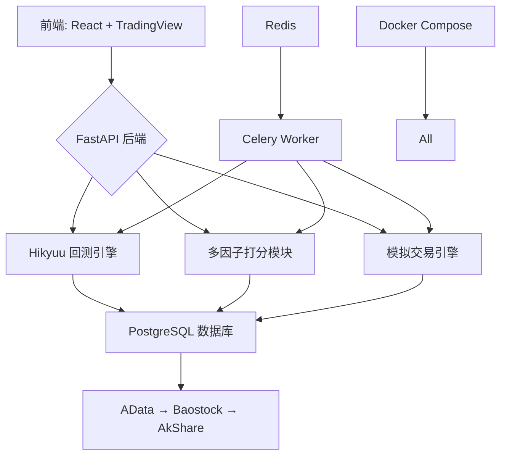

# Leek Quant 技术架构与开发文档

## 1. 项目概述

Leek Quant 是一款专为 A 股市场设计的本地化量化交易平台，基于 **QuantDinger 架构**进行功能裁剪与安全强化。平台坚持“数据不出户、策略不上传”的核心原则，所有历史行情、因子计算、回测模拟均在用户本地完成，彻底规避云端服务带来的隐私泄露风险。

### 设计原则
- **本地优先**：系统默认离线运行，无需注册账号或连接中心服务器。
- **隐私保护**：用户策略代码、交易记录、账户信息全程保留在本地磁盘。
- **开源可审计**：核心技术栈（Hikyuu、AkShare、MyTT）均为开源项目，支持代码审查与自主编译。
- **工程实用导向**：聚焦 A 股差异化规则实现，避免过度抽象和复杂依赖。

> ✅ **最佳实践提示**：建议将项目部署于家庭 NAS 或私有云主机，结合定期快照备份，构建完全自主掌控的投资研究环境。

目标用户为个人开发者、独立研究员及小型量化团队，适用于策略原型验证、多因子选股、模拟实盘训练等场景。

---

## 2. 系统架构图（Mermaid）



### 架构说明

本系统采用前后端分离架构，各组件职责明确：

- **前端层**：React 应用通过 Vite 构建，集成 Monaco Editor 用于策略编写，TradingView Lightweight Charts 展示 K 线与信号叠加。
- **API 层**：FastAPI 提供 RESTful 接口，支持异步请求处理与自动生成 `/docs` 文档界面。
- **任务调度层**：Celery 基于 Redis 消息队列驱动耗时任务（如批量回测、因子计算），确保主线程响应流畅。
- **数据存储层**：PostgreSQL 存储全量结构化数据，使用分区表优化时间序列查询性能。
- **数据采集层**：三层回退机制保障 K 线获取稳定性，增量拉取降低网络开销。
- **容器化部署**：Docker Compose 实现一键启动，包含健康检查与服务依赖管理。

所有数据流均在本地闭环流转，无外部 API 上报行为。

---

## 3. PostgreSQL 表设计

数据库共设计六大类 15 张核心表，遵循高内聚、低耦合原则，并针对查询模式建立索引。

### 3.1 基础/市场数据类（5张）

| 表名 | 字段 | 类型 | 约束 | 用途 |
|------|------|------|------|------|
| `stocks` | id, code, name, market, listed_date | UUID, VARCHAR(10), TEXT, CHAR(2), DATE | PK(id), UK(code) | 股票基本信息 |
| `daily_kline` | stock_id, trade_date, open, high, low, close, volume, amount | UUID, DATE, DECIMAL(10,4), ... | FK(stock_id), PK(stock_id,trade_date) | 日K线数据 |
| `minute_kline` | stock_id, trade_time, open, high, low, close, volume | UUID, TIMESTAMP, DECIMAL(10,4), ... | FK(stock_id), PK(stock_id,trade_time) | 分钟级行情 |
| `index_components` | index_code, stock_code, weight, effective_date | VARCHAR, VARCHAR, DECIMAL, DATE | PK(index_code,stock_code) | 指数成分股 |
| `trading_calendar` | date, is_open | DATE, BOOLEAN | PK(date) | 交易日历 |

> 📌 **工程实现路径**：  
> - 使用 `PARTITION BY RANGE (trade_date)` 对 `daily_kline` 按年分区，提升大表查询效率 。  
> - `code` 字段统一格式为 `SH600000` / `SZ000001`，便于跨源对齐。

```sql
-- 创建按年分区的 daily_kline 主表
CREATE TABLE daily_kline (
    stock_id UUID NOT NULL,
    trade_date DATE NOT NULL,
    open DECIMAL(10,4),
    high DECIMAL(10,4),
    low DECIMAL(10,4),
    close DECIMAL(10,4),
    volume BIGINT,
    amount DECIMAL(18,2),
    PRIMARY KEY (stock_id, trade_date)
) PARTITION BY RANGE (trade_date);

-- 示例子分区
CREATE TABLE daily_kline_2025 PARTITION OF daily_kline
FOR VALUES FROM ('2025-01-01') TO ('2026-01-01');
```

✅ **最佳实践**：启用 `pg_partman` 扩展自动创建未来分区，减少运维负担 。

---

### 3.2 用户/策略类（2张）

| 表名 | 字段 | 类型 | 约束 | 用途 |
|------|------|------|------|------|
| `users` | id, username, created_at | UUID, VARCHAR, TIMESTAMPTZ | PK(id), UK(username) | 用户账户 |
| `strategies` | id, user_id, name, config_json, created_at | UUID, UUID, TEXT, JSONB, TIMESTAMPTZ | PK(id), FK(user_id) | 策略元信息 |

> 📌 **工程实现路径**：  
> - `config_json` 存储策略参数（如均线周期、仓位控制逻辑），支持动态加载。
> - 使用 `JSONB` 类型以便后续扩展字段且不影响已有查询。

```sql
-- 添加表达式索引以加速 JSONB 查询
CREATE INDEX idx_strategy_name ON strategies ((config_json->>'name'));
```

---

### 3.3 回测与信号类（3张）

| 表名 | 字段 | 类型 | 约束 | 用途 |
|------|------|------|------|------|
| `backtests` | id, strategy_id, start_date, end_date, result_json | UUID, UUID, DATE, DATE, JSONB | PK(id), FK(strategy_id) | 回测任务记录 |
| `signals` | id, strategy_id, stock_code, signal_type, target_weight, created_at | BIGINT, UUID, VARCHAR, INT, DECIMAL, TIMESTAMPTZ | PK(id), IDX(created_at) | 五档信号日志 |
| `signal_snapshots` | signal_id, indicator_values_json | BIGINT, JSONB | FK(signal_id) | 信号生成时指标快照 |

> 📌 **工程实现路径**：  
> - `signal_type` 取值范围为 1~5，对应买入、增持、减仓、卖出、观望。
> - `indicator_values_json` 记录触发信号时的技术指标状态（如 RSI=75, MA5>MA10），用于事后归因分析。

```sql
-- 建立复合索引加速按策略+时间查询
CREATE INDEX idx_signals_strategy_time ON signals (strategy_id, created_at DESC);
```

✅ **最佳实践**：对 `result_json` 和 `indicator_values_json` 启用 GIN 索引，支持高效模糊匹配 。

---

### 3.4 因子打分类（2张）

| 表名 | 字段 | 类型 | 约束 | 用途 |
|------|------|------|------|------|
| `factor_definitions` | name, expression, category, description | VARCHAR, TEXT, VARCHAR, TEXT | PK(name) | 因子表达式定义 |
| `factor_values` | stock_code, date, factor_name, value | VARCHAR, DATE, VARCHAR, DOUBLE PRECISION | PK(stock_code,date,factor_name) | 因子计算结果 |

> 📌 **工程实现路径**：  
> - `expression` 字段存储 Qlib 风格表达式，如 `RSI(Close,6)`。
> - `category` 划分为估值、成长、质量、动量四类，支持组合加权评分。

```sql
-- 创建部分索引仅覆盖有效因子
CREATE INDEX idx_factor_value_growth ON factor_values (date, value)
WHERE factor_name LIKE 'growth_%';
```

---

### 3.5 模拟交易类（3张）

| 表名 | 字段 | 类型 | 约束 | 用途 |
|------|------|------|------|------|
| `sim_accounts` | id, initial_cash, available_cash, total_assets, status | UUID, DECIMAL, DECIMAL, DECIMAL, VARCHAR | PK(id) | 模拟账户 |
| `sim_positions` | account_id, stock_code, shares, cost_price, market_value | UUID, VARCHAR, INT, DECIMAL, DECIMAL | PK(account_id,stock_code) | 当前持仓 |
| `sim_orders` | id, account_id, stock_code, direction, price_type, limit_price, volume, status | BIGINT, UUID, VARCHAR, ENUM, ENUM, DECIMAL, INT, ENUM | PK(id) | 委托单 |

> 📌 **工程实现路径**：  
> - `available_cash` 实时扣除冻结资金，防止超买。
> - `price_type` 支持限价、市价、对手价、挂单价等多种申报方式。
> - `status` 包含已提交、部分成交、全部成交、撤单等状态机。

```sql
-- 添加外键约束保证数据一致性
ALTER TABLE sim_positions ADD CONSTRAINT fk_account
FOREIGN KEY (account_id) REFERENCES sim_accounts(id) ON DELETE CASCADE;
```

✅ **最佳实践**：每日收盘后生成 `sim_daily_nav` 快照表，用于绘制净值曲线。

---

## 4. 数据源三层回退策略

为保障数据获取的鲁棒性，系统采用三级降级机制：

| 层级 | 数据源 | 角色定位 | 更新频率 | ST状态时效性 |
|-----|-------|--------|----------|-----------------------------|
| Tier 1 | AData | 主数据源（融合多源） | T+1当日更新 | 中等 |
| Tier 2 | Baostock | 备用数据源 | T+1约1小时延迟 | 差（滞后5.11天） |
| Tier 3 | AkShare | 兜底数据源 | 接近实时 | 优（滞后1.35天） |

### 实现机制

```python
import time
from typing import Optional
import pandas as pd

def fetch_with_fallback(
    symbol: str,
    start_date: str,
    end_date: str
) -> Optional[pd.DataFrame]:
    """带指数退避的三层回退拉取"""
    sources = [
        ("AData", lambda: try_fetch_from_adata(symbol, start_date, end_date)),
        ("Baostock", lambda: try_fetch_from_baostock(symbol, start_date, end_date)),
        ("AkShare", lambda: try_fetch_from_akshare(symbol, start_date, end_date))
    ]

    for i, (name, fetch_func) in enumerate(sources):
        for attempt in range(3):  # 每源最多重试3次
            try:
                data = fetch_func()
                if validate_data(data):  # 校验字段完整性
                    return data
            except Exception as e:
                wait_time = (2 ** attempt) + random.uniform(0, 1)
                time.sleep(wait_time)
        
        log_warning(f"数据源 {name} 连续失败，切换至下一源")
    
    raise DataFetchFailedError("所有数据源均已失效")
```

### 增量拉取机制

基于每只股票维护最后更新日期 `last_trade_date`，仅请求新数据：

```sql
-- 查询某股票最新K线日期
SELECT MAX(trade_date) FROM daily_kline WHERE code = 'SH600000';
```

```python
latest_date = get_latest_kline_date("SH600000")
if latest_date < today():
    new_data = fetch_with_fallback("SH600000", latest_date + 1, today())
    bulk_insert_kline(new_data)  # 批量写入
```

✅ **最佳实践**：
- 使用 `ak.set_cache_dir()` 启用 AkShare 本地缓存，减少重复请求 。
- 对返回数据执行自动化测试，验证条目数量是否超过4000条、关键字段是否存在 。

---

## 5. 回测引擎集成方案

Leek Quant 采用 **Hikyuu C++ 回测引擎**作为核心计算模块，通过 Python 绑定提供高性能策略执行能力。

### 安装与初始化

```bash
pip install "fastapi[standard]" hikyuu==1.3.*
```

```python
# main.py
from fastapi import FastAPI
from hikyuu import hikyuu_init, StockManager

app = FastAPI()

@app.on_event("startup")
def startup():
    hikyuu_init()  # 加载 hikyuu.ini 配置文件
    global sm
    sm = StockManager.instance()  # 全局共享实例
```

> ⚠️ **防御性提示**：Hikyuu 为同步阻塞接口，直接调用会阻塞 FastAPI 事件循环，必须通过线程池隔离 。

### 异步适配层设计

```python
# hikyuu_service.py
import asyncio
from concurrent.futures import ThreadPoolExecutor
from hikyuu.indicator import MA, EMA
from hikyuu.trade_manage import System

executor = ThreadPoolExecutor(max_workers=4)

async def async_backtest(config: dict) -> dict:
    loop = asyncio.get_event_loop()
    return await loop.run_in_executor(executor, _run_backtest_sync, config)

def _run_backtest_sync(config: dict) -> dict:
    # 构造Hikyuu回测对象...
    sys = System(...) 
    result = sys.run()
    return parse_result(result)
```

### A股规则支持

- **T+1限制**：在 `System` 中设置 `enable_t1=True`
- **涨跌停控制**：自动识别涨停价并禁止买入、跌停价禁止卖出
- **交易费用**：支持印花税（0.1%）、佣金（万2.5，最低5元）、过户费（0.001%）

✅ **最佳实践**：将回测任务提交至 Celery Worker 执行，避免占用 API 线程资源。

---

## 6. 五档信号生成逻辑与状态机定义

策略输出五种信号类型，其实际含义由当前持仓状态决定。

### 信号语义映射表

| 信号类型 | 编码 | 描述 |
|---------|-----|------|
| 买入 | 1 | 开始建仓 |
| 增持 | 2 | 增加仓位 |
| 减仓 | 3 | 部分减持 |
| 卖出 | 4 | 清空仓位 |
| 观望 | 5 | 不操作 |

### 状态机转移规则

| 当前状态 \\ 信号 | 1(买入) | 2(增持) | 3(减仓) | 4(卖出) | 5(观望) |
|------------------|--------|--------|--------|--------|--------|
| **空仓** | 建仓 | 建仓 | 忽略 | 忽略 | 忽略 |
| **持仓中** | 忽略 | 加仓 | 减持 | 清仓 | 维持 |

> 📌 **工程实现路径**：根据全局要求，“空仓时‘增持’视为‘买入’”，确保行为一致。

```python
class SignalStateMachine:
    def __init__(self, current_shares: int = 0):
        self.current_shares = current_shares

    def execute(self, signal_type: int) -> str:
        has_position = self.current_shares > 0
        
        if signal_type == 5:  # 观望
            return "NOOP"
        
        if not has_position:
            if signal_type in [1, 2]:
                return "BUY"
            else:
                return "IGNORE"
        else:
            if signal_type == 1:
                return "IGNORE"
            elif signal_type == 2:
                return "ADD"
            elif signal_type == 3:
                return "SELL_PART"
            elif signal_type == 4:
                return "SELL_ALL"
        
        return "INVALID"
```

✅ **最佳实践**：每次信号生成时记录完整市场快照至 `signal_snapshots` 表，支持后期复盘。

---

## 7. 模拟交易引擎工作流

模拟交易引擎完整复现 A 股交易流程，形成从委托到净值的闭环追踪。

### 工作流图解

```
[策略信号] 
    ↓ 解析并生成委托单
[委托单(sim_orders)] → (撮合引擎) → [成交记录(sim_trades)]
    ↓                                ↑
[持仓更新(sim_positions)] ←──────────┘
    ↓
[资金流水(sim_cash_flow)] 
    ↓
[净值快照(sim_daily_nav)]
```

### 核心执行逻辑（Celery Task）

```python
@app.task(bind=True, max_retries=3)
def execute_order_task(self, order_id: int):
    try:
        order = SimOrder.objects.get(id=order_id)
        
        # 1. 检查交易规则
        if not is_trading_day(order.trade_date):
            reject_order(order, "非交易日")
            return
        
        if stock_is_suspended(order.stock_code):
            suspend_order(order)
            return
        
        # 2. 撮合成交
        price = get_exec_price(order.price_type, order.limit_price)
        volume = min(order.volume, get_max_buyable_volume(order.account, price))
        
        trade = SimTrade.objects.create(
            order=order,
            price=price,
            volume=volume,
            amount=price * volume * 100,  # 单位：手
            stamp_tax=calculate_stamp_tax(price, volume),
            commission=calculate_commission(price, volume),
            transfer_fee=calculate_transfer_fee(price, volume)
        )
        
        # 3. 更新持仓与资金
        update_position(order.account, order.stock_code, volume, price)
        deduct_transaction_costs(order.account, trade)
        
        # 4. 生成净值快照
        take_daily_nav_snapshot(order.account, order.trade_date)
        
    except Exception as exc:
        self.retry(exc=exc, countdown=60)
```

### A股特有规则实现

| 规则 | 实现方式 |
|------|--------|
| **T+1** | 持仓表区分 `total_shares` 与 `available_shares`，后者为可卖出数量 |
| **涨跌停** | 实时计算涨跌停价，市价单按涨停/跌停申报，限价单越界则拒绝 |
| **停牌** | 所有卖出委托进入挂起队列，每日尝试恢复 |
| **手续费** | 动态计算，支持最低5元佣金保护 |

✅ **最佳实践**：每日收盘后自动运行 `generate_daily_nav` 任务，生成连续净值曲线。

---

## 8. 多因子打分模块设计

借鉴 **Qlib 表达式范式**，实现轻量化的因子定义与计算框架。

### 因子分类体系

| 类别 | 代表因子 | MyTT 实现示例 |
|------|--------|--------------|
| 估值 | PE_TTM, PB_LF | `fundamental['pe_ttm']` |
| 成长 | YOY_NET_PROFIT | `(cur - prev) / abs(prev)` |
| 质量 | ROE, GROSS_MARGIN | `fundamental['roe']` |
| 动量 | RSI6, BIAS6 | `RSI(CLOSE, 6)` |

### 表达式语法兼容

支持 Qlib 风格声明式语法，允许组合嵌套：

```yaml
# factors.yaml
factors:
  MA20: MA(Close, 20)
  RSI6: RSI(Close, 6)
  Volatility: STD(Return, 20)
  AdaptiveMA: MA(Close, IF($Volatility > QUANTILE($Volatility, 60, 0.7), 10, 30))
```

```python
from qlib.data.ops import register_op

@register_op("YoY")
def year_on_year(series, period=250):
    return series / series.shift(period) - 1
```

### IC/IR 分析流程

每日自动运行因子有效性评估：

```python
def analyze_ic_ir(factor_name: str, date: str):
    df = load_factor_and_returns(factor_name, date, horizon=5)
    ic = df['factor'].corr(df['future_return'])
    ir = ic.mean() / ic.std()
    
    save_analysis_result(factor_name, date, ic, ir)
```

✅ **最佳实践**：使用 YAML 文件集中管理因子定义，支持版本控制与团队协作 。

---

## 9. 前端页面与组件规划

前端基于现代 Web 技术栈构建，注重交互体验与性能表现。

### 技术选型

| 组件 | 技术 | 版本要求 |
|------|------|--------|
| 构建工具 | Vite | >=4.0 |
| 框架 | React | >=18.0 |
| 样式 | Tailwind CSS | >=3.0 |
| 图表 | TradingView Lightweight Charts | >=3.8 |
| 编辑器 | Monaco Editor | VS Code 内核 |

### 页面布局

```tsx
<Layout>
  <SidebarNav /> {/* 策略/因子/账户导航 */}
  <MainContent>
    <KLineChart data={klineData} signals={signals} />
    <StrategyEditor defaultValue="// 输入MyTT策略" />
    <FactorPanel factors={currentFactors} />
  </MainContent>
  <LogPanel logs={runtimeLogs} />
</Layout>
```

### 关键组件应用场景

- **Lightweight Charts**：展示 K 线图，叠加五档信号图标与技术指标。
- **Monaco Editor**：支持语法高亮、自动补全、错误提示，用于编写 MyTT 策略。
- **Draggable Panels**：用户可自由调整面板大小与位置，适应不同屏幕。

✅ **最佳实践**：启用 Web Workers 处理大数据渲染，避免主线程卡顿。

---

## 10. Docker Compose 部署架构说明

提供标准化 `docker-compose.yml` 文件，实现一键部署。

```yaml
version: '3.8'
services:
  fastapi:
    build: .
    ports:
      - "8000:8000"
    environment:
      - DATABASE_URL=postgresql+asyncpg://user:password@db:5432/leekquant
      - REDIS_URL=redis://redis:6379/0
    depends_on:
      db:
        condition: service_healthy
      redis:
        condition: service_healthy

  celery_worker:
    build: .
    command: celery -A worker start --loglevel=info
    environment:
      <<: *common_env

  db:
    image: postgres:13
    environment:
      POSTGRES_USER: user
      POSTGRES_PASSWORD: password
      POSTGRES_DB: leekquant
    volumes:
      - postgres_data:/var/lib/postgresql/data
    healthcheck:
      test: ["CMD-SHELL", "pg_isready -U user"]
      interval: 10s
      timeout: 5s
      retries: 5

  redis:
    image: redis:6.2-alpine
    command: redis-server --requirepass your_strong_password
    healthcheck:
      test: ["CMD", "redis-cli", "ping"]
      interval: 10s

volumes:
  postgres_data:
```

### 启动命令

```bash
# 构建并启动所有服务
docker-compose up -d --build

# 查看日志
docker-compose logs -f

# 停止服务
docker-compose down
```

✅ **最佳实践**：添加 `.env` 文件管理敏感配置，避免硬编码密码。

---

## 11. 风险识别与应对措施

| 风险类别 | 具体风险 | 应对措施 |
|--------|--------|--------|
| **数据源失效** | AData 接口变更或不可用 | 采用三层回退策略；增加 Tushare 免费版作为第四层备选 |
| **实时行情延迟** | WebSocket 断连导致数据中断 | 启用心跳保活（ping_interval=30s）；断线自动重连 |
| **回测过拟合** | 策略在样本外表现差 | 强制划分训练集/测试集；监控 IC 衰减趋势 |
| **系统崩溃** | 突发断电或硬件故障 | 每日自动备份数据库；支持从快照恢复 |
| **协议变更** | 东方财富 WebSocket 协议逆向失效 | 定期抓包验证字段映射；引入 AllTick 作为替代方案  |
| **法律合规** | 高频采集涉嫌违反网站条款 | 控制请求频率；使用随机 User-Agent；禁止商业用途  |

### 主动防御机制

- **监控告警**：对数据拉取成功率、响应时间设置阈值告警。
- **自动化测试**：每日运行端到端测试，验证全链路正确性。
- **灰度发布**：新策略先在模拟账户运行一周再接入实盘。

✅ **最佳实践**：建立 `requirements.txt` 锁定依赖版本，确保环境可复现。

```txt
fastapi>=0.95,<1.0.0
hikyuu==1.3.*
akshare>=1.9.0
baostock>=0.9.0
MyTT>=1.0.0
psycopg2-binary>=2.9.0
celery[redis]>=5.2.0
pydantic>=2.0.0
```

--- 

> 本文档持续更新，最新版本请访问 GitHub 仓库。

[1]:https://blog.csdn.net/2501_93894473/article/details/154202670 "PostgreSQL 分区表：按时间 / 范围拆分大表-CSDN博客"
[2]:https://blog.csdn.net/2501_93895791/article/details/153880991 "PostgreSQL分区表优化：范围分区与列表分区实践_pgsql 分区表from和to的范围-CSDN博客"
[3]:https://blog.csdn.net/gsfddsfsd/article/details/153973965 "PostgreSQL 新手入门：一文读懂 json 与 jsonb 类型的 6 大关键区别_postgres json jsonb 区别-CSDN博客"
[4]:https://wenku.csdn.net/column/70s1y016jdm1 "【A股数据可信度红皮书】：实测对比12家API（Tushare_Akshare_BaoStock_Wind_Choice等）在387只ST股、562次非交易日、23轮新股涨跌幅规则变更下的数据一致性——99.2%失效案例已结构化归因 - CSDN文库"
[5]:https://blog.csdn.net/gitblog_00579/article/details/159491148 "AKShare金融数据接口库：从数据获取到策略落地的全流程指南-CSDN博客"
[6]:https://blog.csdn.net/gitblog_00993/article/details/159813942 "AKShare股票接口数据异常深度修复指南：从诊断到长效保障-CSDN博客"
[7]:https://blog.csdn.net/gitblog_01413/article/details/150514084 "Hikyuu Quant Framework 技术文档-CSDN博客"
[8]:https://gitee.com/qingzhongjiang/MyTT "MyTT: 通达信T、同花顺T，转Python神器"
[9]:https://blog.csdn.net/gitblog_00829/article/details/159577062 "Qlib表达式引擎：让量化因子开发效率提升10倍的技术利器-CSDN博客"
[10]:https://developer.volcengine.com/articles/7638288823163551782 "A 股实时行情，用 WebSocket 一步到位 - 文章 - 开发者社区 - 火山引擎"
[11]:https://zeeklog.com/shi-zhan-pythonshi-shi-pa-qu-dong-fang-cai-fu-wang-gu-piao-xing-qing-websocketjie-kou-jie-xi-di-yan-chi-you-hua-8 "Python 实时爬取东方财富网股票行情：WebSocket 接口解析与低延迟优化 \| 极客日志"
